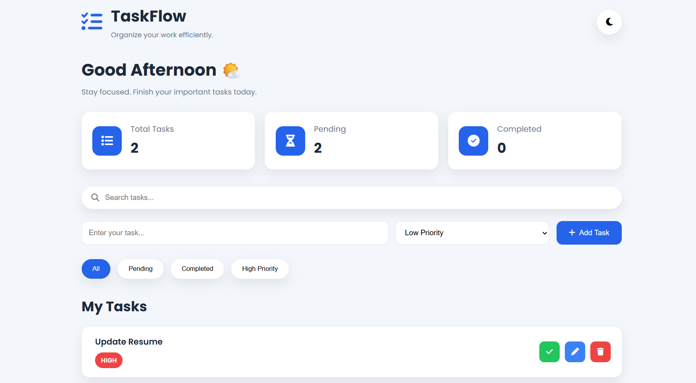
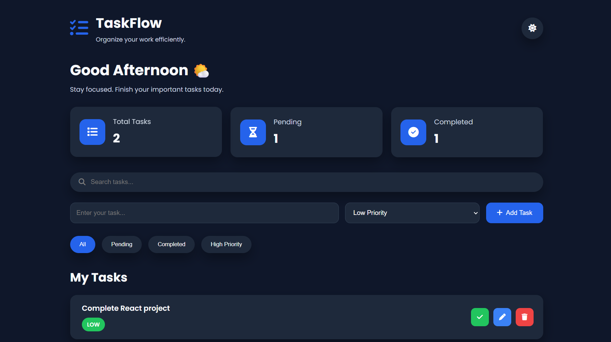

# ⚡ TaskFlow – Productivity Manager

A modern and responsive **Task Management Application** built using **HTML, CSS, and JavaScript**.

TaskFlow helps users organize their daily work efficiently with priority management, task filtering, dark/light mode, and browser-based data persistence using Local Storage.

---

## 🌐 Live Demo

🔗 **Live Website:**  
[🌐 Live Demo](https://taskflow-bhoomikamishra.netlify.app)

📂 **GitHub Repository:**  
[📂 GitHub Repository](https://github.com/BhoomikaMishra/taskflow-productivity-manager)

---

## 🛠️ Built With


---

## 📖 Overview

TaskFlow is a lightweight and responsive productivity application that helps users manage their daily tasks in an organized way.

The application allows users to create, update, complete, and remove tasks while categorizing them by priority. All task data is stored in the browser using Local Storage, ensuring that tasks remain available even after refreshing or reopening the application.

This project was developed to strengthen core frontend development skills, including JavaScript, DOM manipulation, event handling, responsive design, and browser storage.

---

## ✨ Features

- ➕ Add new tasks
- ✏️ Edit existing tasks
- 🗑️ Delete tasks
- ✔️ Mark tasks as completed
- 🎯 Set task priority (High, Medium, Low)
- 🔍 Filter tasks by status and priority
- 📊 Dashboard with task statistics
- 🌙 Dark Mode and ☀️ Light Mode
- 💾 Automatic data saving using Local Storage
- 📱 Responsive design for different screen sizes


---

## 📷Application Preview

<p align="center">
  
  
</p>

<p align="center">
  <b>Light Mode</b> &nbsp;&nbsp;&nbsp;&nbsp;&nbsp;&nbsp;&nbsp;&nbsp;&nbsp;&nbsp;&nbsp;&nbsp;&nbsp;&nbsp;&nbsp;&nbsp;&nbsp;&nbsp;&nbsp;&nbsp;&nbsp;&nbsp;&nbsp;&nbsp;&nbsp;&nbsp;&nbsp;&nbsp;
  <b>Dark Mode</b>
</p>

---

## 🛠️ Tech Stack

| Technology | Purpose |
|------------|---------|
| HTML5 | Structure and semantic layout |
| CSS3 | Styling, animations, and responsive design |
| JavaScript | Application logic and DOM manipulation |
| Local Storage | Persist task data in the browser |
| Git | Version control |
| GitHub | Code hosting and collaboration |
| Netlify | Deployment and hosting |

---

## 📁 Project Structure

```text
TaskFlow/
│
├── images/
│   ├── light-mode.png
│   └── dark-mode.png
│
├── index.html
├── style.css
├── app.js
└── README.md
```

---

## 🚀 Getting Started

### Clone the repository

```bash
git clone https://github.com/BhoomikaMishra/taskflow-productivity-manager.git
```

### Navigate to the project folder

```bash
cd taskflow-productivity-manager
```

### Run the project

Open the **index.html** file in your preferred web browser.

> No additional installation or dependencies are required.

---

## 🔮 Future Improvements

Some features planned for future versions include:

- 🔍 Search tasks by keyword
- 📅 Due dates and reminders
- 🏷️ Task categories and labels
- 📈 Productivity analytics
- 📤 Export and import tasks
- ☁️ Cloud synchronization
- 👤 User authentication

---

## 👩‍💻 Author

**Bhoomika Mishra**

Aspiring Full Stack Developer

Passionate about creating modern, responsive, and user-friendly web applications while continuously learning new technologies.

- **GitHub:** https://github.com/BhoomikaMishra

---

## ⭐ Show Your Support

If you found this project helpful, consider giving it a ⭐ on GitHub.

It motivates me to continue building and improving my projects.